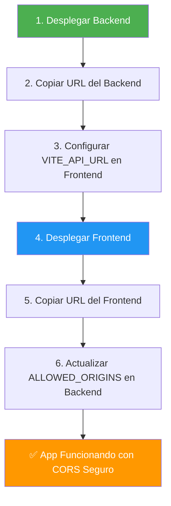

# ✅ Configuración Completada

## 🎉 ¡Todo Listo!

He configurado tu aplicación para Railway con las siguientes mejoras:

---

## 1️⃣ Variables de Entorno Configuradas

### 📄 Archivo Creado: `RAILWAY_SETUP.md`

Este archivo contiene **instrucciones paso a paso** para configurar las variables de entorno en Railway.

**Variables del Backend:**
```env
GOOGLE_API_KEY=tu_clave_aqui
YOUTUBE_API_KEY=tu_clave_aqui
CHROMA_DB_DIR=/app/chroma_db
PYTHONUNBUFFERED=1
ALLOWED_ORIGINS=http://localhost:3000
```

**Variables del Frontend:**
```env
VITE_API_URL=https://tu-backend-url.railway.app
```

📖 **Lee el archivo completo**: [`RAILWAY_SETUP.md`](file:///c:/TeLoExplico/RAILWAY_SETUP.md)

---

## 2️⃣ CORS Actualizado y Mejorado

### ✨ Cambios en `backend/main.py`

**Antes:**
```python
# CORS abierto a todos (inseguro)
allow_origins=["*"]
```

**Ahora:**
```python
# CORS configurable por variable de entorno (seguro)
allowed_origins = os.getenv("ALLOWED_ORIGINS", "http://localhost:3000").split(",")
allow_origins=allowed_origins
```

### 🔒 Beneficios de Seguridad

✅ **Desarrollo Local**: Funciona con `http://localhost:3000`  
✅ **Producción**: Solo acepta peticiones de tu frontend en Railway  
✅ **Flexible**: Puedes agregar múltiples dominios separados por comas  
✅ **Seguro**: No acepta peticiones de orígenes no autorizados  

---

## 3️⃣ Flujo de Despliegue Actualizado

### Paso a Paso:



---

## 📋 Checklist de Configuración

### Backend
- [x] CORS actualizado a usar variables de entorno
- [x] `ALLOWED_ORIGINS` agregada a `.env.example`
- [x] Dockerfile actualizado para usar `$PORT` de Railway
- [x] Documentación de variables creada

### Frontend
- [x] Ya usa `VITE_API_URL` correctamente
- [x] `.env.example` ya configurado
- [x] Listo para desplegar

### Documentación
- [x] `RAILWAY_SETUP.md` - Guía de variables de entorno
- [x] `RAILWAY_DEPLOY.md` - Guía de despliegue
- [x] `RAILWAY_CHECKLIST.md` - Checklist interactivo
- [x] `RAILWAY_OPTIMIZATION.md` - Tips de optimización

---

## 🚀 Próximos Pasos

### 1. Prepara tus API Keys

Necesitas tener a mano:
- `GOOGLE_API_KEY` - Para Gemini AI
- `YOUTUBE_API_KEY` - Para búsqueda de videos

### 2. Sigue la Guía de Setup

Abre [`RAILWAY_SETUP.md`](file:///c:/TeLoExplico/RAILWAY_SETUP.md) y sigue los 3 pasos:
1. Configurar variables del backend
2. Configurar variables del frontend
3. Actualizar CORS después del despliegue

### 3. Despliega en Railway

Usa [`RAILWAY_DEPLOY.md`](file:///c:/TeLoExplico/RAILWAY_DEPLOY.md) como guía principal.

---

## 🎯 Ejemplo de Configuración Final

### En Railway - Backend Service

```env
GOOGLE_API_KEY=AIzaSyABC123...
YOUTUBE_API_KEY=AIzaSyXYZ789...
CHROMA_DB_DIR=/app/chroma_db
PYTHONUNBUFFERED=1
ALLOWED_ORIGINS=http://localhost:3000,https://teloexplico-frontend-production.up.railway.app
```

### En Railway - Frontend Service

```env
VITE_API_URL=https://teloexplico-backend-production.up.railway.app
```

---

## 🔍 Verificación

Después de desplegar, verifica que:

1. **Backend responde**: Visita `https://tu-backend.railway.app/health`
   - Deberías ver: `{"status": "ok"}`

2. **Frontend carga**: Visita `https://tu-frontend.railway.app`
   - La página debe cargar correctamente

3. **CORS funciona**: Sube un documento desde el frontend
   - No debe haber errores de CORS en la consola del navegador

---

## 🆘 Si Algo Sale Mal

### Error: CORS blocked
**Solución**: Verifica que `ALLOWED_ORIGINS` incluye la URL exacta del frontend

### Error: Backend no responde
**Solución**: Revisa los logs en Railway → Backend Service → Logs

### Error: Frontend no conecta
**Solución**: Verifica que `VITE_API_URL` tiene la URL correcta del backend

---

## 📚 Recursos

| Documento | Propósito |
|-----------|-----------|
| [`RAILWAY_SETUP.md`](file:///c:/TeLoExplico/RAILWAY_SETUP.md) | **Variables de entorno** (EMPIEZA AQUÍ) |
| [`RAILWAY_DEPLOY.md`](file:///c:/TeLoExplico/RAILWAY_DEPLOY.md) | Guía de despliegue completa |
| [`RAILWAY_CHECKLIST.md`](file:///c:/TeLoExplico/RAILWAY_CHECKLIST.md) | Checklist paso a paso |
| [`RAILWAY_OPTIMIZATION.md`](file:///c:/TeLoExplico/RAILWAY_OPTIMIZATION.md) | Tips de optimización |

---

## ✨ Mejoras Implementadas

1. ✅ CORS seguro con variables de entorno
2. ✅ Soporte para múltiples orígenes (local + Railway)
3. ✅ Documentación completa de variables
4. ✅ Ejemplos claros y específicos
5. ✅ Guías paso a paso
6. ✅ Dockerfile optimizado para Railway

---

**¿Listo para desplegar?** 🚀

Abre [`RAILWAY_SETUP.md`](file:///c:/TeLoExplico/RAILWAY_SETUP.md) y comienza con el **Paso 1**.
